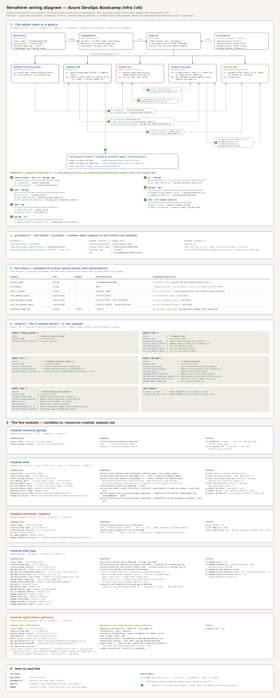

# Azure DevOps Bootcamp Project

A complete, hands-on Azure DevOps project that containerizes a personal portfolio website, provisions its Azure infrastructure with Terraform, deploys it through GitHub Actions, authenticates to Azure with OpenID Connect (OIDC), keeps Terraform state remotely in Azure Blob Storage, and exposes the application through a controlled Azure networking design.

The application hosted by this project is my personal portfolio website.

---

## Table of Contents

1. [Project Overview](#project-overview)
2. [Architecture](#architecture)
3. [Architecture Wiring Diagram](#architecture-wiring-diagram)
4. [Repository Structure](#repository-structure)
5. [Application and Docker](#application-and-docker)
6. [Terraform](#terraform)
7. [Azure Infrastructure Details](#azure-infrastructure-details)
8. [GitHub Actions CI/CD](#github-actions-cicd)
9. [Terraform Remote State](#terraform-remote-state)
10. [Security Approach](#security-approach)
11. [Running It Yourself](#running-it-yourself)
12. [Cost Management and Cleanup](#cost-management-and-cleanup)
13. [Problems Encountered and Resolved](#problems-encountered-and-resolved)
14. [Lessons Learned](#lessons-learned)
15. [Technologies Used](#technologies-used)
16. [Future Improvements](#future-improvements)
17. [Project Status](#project-status)

---

## Project Overview

This project was built as a practical, end-to-end Azure DevOps implementation rather than a collection of isolated tutorials. The goal was to understand how an application travels from source code on a local machine to a running application in Azure.

It covers:

* Application development (HTML, CSS, JavaScript)
* Git and GitHub
* Docker containerization
* Azure Container Registry (ACR)
* Azure Web App for Containers
* Azure Virtual Network, public and private subnets
* Network Security Groups and route tables
* Private Endpoint and Private DNS
* Application Gateway
* Terraform Infrastructure as Code, with reusable modules
* Terraform remote state in Azure Blob Storage
* GitHub Actions CI/CD
* Azure OIDC authentication, Azure RBAC and Managed Identity
* Container image versioning using the Git commit SHA
* Deployment verification
* Azure resource cleanup and cost control

---

## Architecture

The portfolio website is packaged into a Docker container. Terraform provisions the Azure infrastructure that hosts it. GitHub Actions automates the whole process whenever changes are pushed to the `dev` branch.

```text
Developer
   |
   v
GitHub Repository
   |
   v
GitHub Actions
   |
   +--------------------+
   |                    |
   v                    v
Terraform           Docker Build
   |                    |
   v                    v
Azure Infrastructure   Azure Container Registry
                            |
                            v
                       Azure Web App
                            |
                            v
                    Private Endpoint
                            |
                            v
                     Application Gateway
                            |
                            v
                       End User
```

At runtime, a visitor never talks to the Web App directly:

```text
Internet -> Public IP -> Application Gateway -> Private Endpoint -> Web App -> Portfolio container (Nginx)
```

---

## Architecture Wiring Diagram

The diagram below shows how the Terraform files and modules are wired together: which value comes from `dev.tfvars`, how it passes through `variables.tf` and `main.tf`, which resources each module creates, and which module output feeds which module input.




### How to read the diagram

* **Solid blue arrows** show values being fed in: `dev.tfvars` -> `variables.tf` -> `main.tf` -> module.
* **Dashed green lines** show one module's output feeding another module. The label on each line reads `source output -> target input`.
* The **numbers (1 to 7)** follow the build order, and each number matches an entry in the wiring key below.

### Wiring key (build order)

| Step | Connection | Output -> Input |
| ---- | ---------- | --------------- |
| 1 | `resource_group` -> `vnet`, `acr`, `web_app`, `agw` | `az_rg_name_out` -> `resource_group_name`<br>`az_rg_location_out` -> `resource_group_location` |
| 2 | `vnet` -> `web_app` | `az_vnet_id_out` -> `web_app_vnet_id`<br>`az_priv_sub_id_ep_out` -> `web_app_private_subnet_id`<br>`az_priv_sub_id_vnet_intgr_out` -> `web_app_vnet_integration_subnet_id` |
| 3 | `vnet` -> `agw` | `az_public_ip_id_out` -> `public_ip_id`<br>`az_pub_sub_id_out` -> `agw_subnet_id` |
| 4 | `web_app` -> `acr` | `az_webapp_identity_principal_id_out` -> `webapp_identity_principal_id` |
| 5 | `acr` -> `web_app` | `az_acr_login_server_out` -> `web_app_container_login_server` |
| 6 | `web_app` -> `agw` | `az_webapp_private_endpoint_ip_out` -> `web_app_backend_priv_ip`<br>`az_webapp_hostname_out` -> `web_app_backend_hostname` |
| 7 | `vnet` -> root outputs | `az_public_ip_out` -> `az_public_ip_show`<br>`az_public_ip_fqdn_out` -> `az_public_ip_fqdn_show` |

Steps 4 and 5 are a two-way link between `acr` and `web_app`: the Web App's managed identity is given the `AcrPull` role on the registry (step 4), and the registry's login server tells the Web App where to pull its image from (step 5). See [Module Dependency Flow](#module-dependency-flow) for why Terraform handles this without a circular dependency.

---

## Repository Structure

```text
.
│
├── .gitignore
├── Daigrams.txt
├── README.md
│
├── architecture/
│   ├── wiring-diagram.png
│   └── wiring-diagram.svg
│
├── .github/
│   └── workflows/
│       └── Deploy-to-Azure.yml
│
├── application/
│   ├── Dockerfile
│   ├── index.html
│   ├── main.js
│   ├── stylesheet.css
│   └── Assets/
│       ├── Background pic/
│       └── Profile Photo/
│
└── terraform/
    ├── .terraform.lock.hcl
    ├── dev.tfvars
    ├── main.tf
    ├── provider.tf
    ├── variables.tf
    │
    └── modules/
        ├── resource_group/
        │   ├── rg.tf
        │   ├── variables.tf
        │   └── outputs.tf
        ├── vnet/
        │   ├── vnet.tf
        │   ├── nsg.tf
        │   ├── route.tf
        │   ├── public_ip.tf
        │   ├── variables.tf
        │   └── outputs.tf
        ├── container_registry/
        │   ├── acr.tf
        │   ├── variables.tf
        │   └── outputs.tf
        ├── web_app/
        │   ├── web_app.tf
        │   ├── variables.tf
        │   └── outputs.tf
        └── application_gateway/
            ├── agw.tf
            ├── variables.tf
            └── outputs.tf
```

Terraform-generated files (the `.terraform/` directory, state files and plan files) are not committed to Git.

---

## Application and Docker

The application is my personal portfolio website, made of HTML, CSS, JavaScript and image assets under `application/`.

```text
application/
├── Dockerfile
├── index.html
├── main.js
├── stylesheet.css
└── Assets/
    ├── Background pic/
    │   ├── Background_image.png
    │   ├── Background_image2.png
    │   ├── Background_image_About.png
    │   ├── Background_image_Contact.png
    │   └── Background_image_Project.png
    └── Profile Photo/
        ├── dipmita-profile.jpg
        └── dipmita-profile_about.png
```

Docker is the packaging layer between the source code and Azure. Instead of deploying individual files, the whole site is packaged into one container image (Nginx plus the website files):

```text
Portfolio source code -> Dockerfile -> Docker image -> Azure Container Registry -> Azure Web App
```

* **Registry:** `acrazuredevopsbootcamp` (created by Terraform as `acr${project_name}`)
* **Repository:** `azuredevopsbootcampapp`
* **Tag:** the Git commit SHA, for example `acrazuredevopsbootcamp.azurecr.io/azuredevopsbootcampapp:<commit-sha>`

Tagging with the commit SHA means every deployed image can be traced to the exact commit that produced it, and it makes rollback straightforward.

---

## Terraform

### Root files

| File | Purpose |
| ---- | ------- |
| `provider.tf` | Requires Terraform `>=1.16.0`, pins the `azurerm` provider to exactly `5.0.0`, configures the `azurerm` remote backend and the `azurerm` provider (`features {}`) |
| `variables.tf` | Declares the root variables (type, description, default) |
| `dev.tfvars` | Supplies the actual values for the `dev` environment |
| `main.tf` | Calls the five modules, wires their outputs to each other's inputs, and defines two root outputs |

### Root variables

| Variable | Type | Default | `dev.tfvars` value | Used in `main.tf` |
| -------- | ---- | ------- | ------------------ | ----------------- |
| `project_name` | string | none | `"azuredevopsbootcamp"` | Passed to all five modules |
| `environment` | string | none | `"dev"` | Declared and set, but not referenced by any module block |
| `azure_location` | string | none | `"Central India"` | `resource-group` module (`resource_group_location`) |
| `vnet_address_space` | list(string) | none | `["10.0.0.0/24"]` | `vnet` module |
| `pub_sub_address_space` | list(string) | none | `["10.0.0.0/26", "10.0.0.64/26"]` | `vnet` module |
| `priv_sub_address_space` | list(string) | none | `["10.0.0.128/26", "10.0.0.192/26"]` | `vnet` module |
| `container_image_tag` | string | `"latest"` | `"latest"` | `web_app` module (`webapp_docker_image_tag`) |

In CI/CD the image tag is overridden with the commit SHA (see [GitHub Actions CI/CD](#github-actions-cicd)).

### Root outputs

`main.tf` defines two outputs that print the application URL after `terraform apply`:

| Output | Built from |
| ------ | ---------- |
| `az_public_ip_show` | `http://` + `module.vnet.az_public_ip_out` |
| `az_public_ip_fqdn_show` | `http://` + `module.vnet.az_public_ip_fqdn_out` |

### Modules

Terraform is split into reusable modules, each with its own `variables.tf` (inputs) and `outputs.tf` (outputs).

| Module | Folder | What it creates | Key outputs |
| ------ | ------ | --------------- | ----------- |
| `resource_group` | `modules/resource_group` | Resource group `rg-<project_name>` | `az_rg_name_out`, `az_rg_location_out` |
| `vnet` | `modules/vnet` | Virtual network, 2 public and 2 private subnets, 2 NSGs and their associations, 2 route tables and their associations, public IP | `az_vnet_id_out`, `az_pub_sub_id_out`, `az_priv_sub_id_ep_out`, `az_priv_sub_id_vnet_intgr_out`, `az_public_ip_id_out`, `az_public_ip_out`, `az_public_ip_fqdn_out` |
| `container_registry` | `modules/container_registry` | Azure Container Registry and the `AcrPull` role assignment | `az_acr_id_out`, `az_acr_name_out`, `az_acr_login_server_out` |
| `web_app` | `modules/web_app` | App Service Plan, Linux Web App, Private Endpoint, Private DNS zone and VNet link | `az_webapp_id_out`, `az_webapp_hostname_out`, `az_webapp_private_endpoint_id_out`, `az_webapp_private_endpoint_ip_out`, `az_webapp_identity_principal_id_out` |
| `application_gateway` | `modules/application_gateway` | Application Gateway (listener, backend pool, HTTP settings, probe, routing rule) | `az_agw_id_out` |

### Module Dependency Flow

Modules are connected only through outputs and variables in the root `main.tf`. The build order follows the numbered wiring key above:

```text
1. resource_group      -> name and location go to vnet, acr, web_app and agw
2. vnet                -> web_app gets the VNet id and the two private subnet ids
3. vnet                -> agw gets its subnet and public IP
4. web_app  <-> acr    -> identity principal id goes to acr (AcrPull),
                          acr login server goes to web_app (image source)
5. web_app             -> agw gets the private endpoint IP and the hostname
6. vnet                -> public IP values become the root output URLs
```

`acr` and `web_app` reference each other's outputs. This works because Terraform builds its dependency graph from individual resources, not whole modules:

```text
Container Registry  ->  Linux Web App  ->  AcrPull role assignment
(needs only the         (needs the ACR        (needs the registry id and
 resource group)         login server)         the web app's identity)
```

So the registry is created first, then the Web App, and finally the role assignment that lets the Web App pull from the registry.

---

## Azure Infrastructure Details

```text
Resource Group (rg-azuredevopsbootcamp)
    |
    +-- Virtual Network (10.0.0.0/24)
    |     +-- Public subnets, Private subnets
    |     +-- Network Security Groups
    |     +-- Route tables
    |
    +-- Public IP (Static)
    +-- Azure Container Registry
    +-- App Service Plan
    +-- Linux Web App
    +-- Private Endpoint
    +-- Private DNS Zone and VNet link
    +-- Application Gateway
```

### Virtual Network and subnets

The VNet address space is `10.0.0.0/24`, divided into four `/26` subnets.

| Subnet | CIDR | Purpose |
| ------ | ---- | ------- |
| Public subnet 1 | `10.0.0.0/26` | Hosts the Application Gateway |
| Public subnet 2 | `10.0.0.64/26` | Created for the public tier (nothing is deployed into it yet) |
| Private subnet 1 | `10.0.0.128/26` | Web App VNet Integration (the Web App's **outbound** traffic). Delegated to `Microsoft.Web/serverFarms` |
| Private subnet 2 | `10.0.0.192/26` | Web App Private Endpoint (the Web App's **inbound** traffic). Private endpoint network policies are disabled |

The two private subnets exist because VNet Integration and Private Endpoint are two different mechanisms: **VNet Integration is the Web App going out, the Private Endpoint is traffic coming in.**

### Network Security Groups

| NSG | Applied to | Rules |
| --- | ---------- | ----- |
| `nsg-agw-<project>` | Public subnet 1 | Inbound TCP 80 from the Internet; inbound TCP 65200-65535 from `GatewayManager` (required for Application Gateway v2) |
| `nsg-app-<project>` | Both private subnets | Inbound TCP 80 from the public subnet address range |

### Route tables

| Route table | Applied to | Routes |
| ----------- | ---------- | ------ |
| `rt-pub-sub-<project>` | Public subnet 1 | `0.0.0.0/0` -> `Internet` |
| `rt-priv-sub-<project>` | Both private subnets | No custom routes |

### Application Gateway

The Application Gateway is the public entry point. It sits in public subnet 1 with a static public IP, while the Web App has public access turned off.

| Setting | Value |
| ------- | ----- |
| SKU | `Standard_v2`, autoscale 0 to 2 |
| Listener | HTTP, port 80 |
| Backend pool | The Web App's Private Endpoint IP |
| Backend HTTP settings | HTTP, port 80, `host_name` = Web App hostname, cookie affinity disabled, 60 s request timeout |
| Health probe | `GET /`, interval 30 s, timeout 30 s, unhealthy threshold 3, host name taken from the backend HTTP settings |
| Routing rule | Basic, priority 9 |

The backend pool uses the private IP to decide **where** to connect, and the hostname tells App Service **which site** is being requested.

### Private Endpoint and Private DNS

```hcl
public_network_access_enabled = false
```

The Web App is not reachable through its public endpoint. A Private Endpoint (sub-resource `sites`) in private subnet 2 gives it a private IP inside the VNet.

A Private DNS zone named `privatelink.azurewebsites.net` is linked to the VNet so the Web App's name resolves to that private IP from inside the network:

```text
Application Gateway -> Private DNS resolution -> Private Endpoint -> Azure Web App
```

### Azure Container Registry

Created as `acr<project_name>`, SKU `Basic`, with the admin user **disabled**. Access is granted through Azure RBAC only.

### Web App and Managed Identity

The application runs on a Linux Web App (App Service Plan SKU `B1`) configured to run the Docker image from ACR. Hardening settings include FTPS disabled, HTTP/2 enabled, minimum TLS 1.2 and WebSockets off.

The Web App has a **System Assigned Managed Identity**, and `container_registry_use_managed_identity` is turned on. A role assignment gives that identity the `AcrPull` role on the registry:

```text
Azure Web App --(Managed Identity)--> Azure RBAC (AcrPull) --> Azure Container Registry --> image
```

No registry username or password is stored anywhere.

---

## GitHub Actions CI/CD

The pipeline lives at `.github/workflows/Deploy-to-Azure.yml` and runs when code is pushed to the `dev` branch.

```text
 1. Checkout repository
 2. Authenticate to Azure using OIDC
 3. Verify the Azure account
 4. Install Terraform
 5. Terraform init
 6. Terraform validate
 7. Terraform plan
 8. Terraform apply
 9. Refresh Azure authentication
10. Log in to ACR
11. Build the Docker image
12. Push the Docker image
13. Verify the image in ACR
14. Restart the Azure Web App
```

### OIDC authentication

The workflow requests an OIDC token instead of using a stored Azure client secret:

```yaml
permissions:
  id-token: write
  contents: read
```

The Azure login uses `client-id`, `tenant-id` and `subscription-id`, stored as GitHub repository secrets. No password is stored.

```text
GitHub Actions --(OIDC token)--> Microsoft Entra ID --> Azure identity --> Azure resources
```

### Image tag = Git commit SHA

```yaml
IMAGE_TAG: ${{ github.sha }}
```

Terraform receives the same value as `container_image_tag=${{ github.sha }}`, so the deployed Web App, the ACR image tag and the Git commit are all tied together:

```text
Git commit -> SHA -> Docker image tag -> ACR repository -> Azure Web App
```

This is far more traceable than a generic `latest` tag.

---

## Terraform Remote State

Terraform state was initially local. That does not work in CI/CD, because GitHub-hosted runners are temporary and cannot rely on a file that lives on a developer's laptop. The project therefore uses an Azure Blob Storage backend:

```hcl
backend "azurerm" {
  resource_group_name  = "rg-terraform-state"
  storage_account_name = "stterraformstatebootcamp"
  container_name       = "tfstate"
  key                  = "azuredevopsbootcamp.tfstate"
}
```

| Item | Value |
| ---- | ----- |
| Resource group | `rg-terraform-state` |
| Storage account | `stterraformstatebootcamp` |
| Container | `tfstate` |
| State blob | `azuredevopsbootcamp.tfstate` |

```text
Developer / GitHub Actions -> Terraform -> Azure Blob Storage -> azuredevopsbootcamp.tfstate
```

The backend resource group and storage account are **not** created by this Terraform code; they must exist before `terraform init` is run.

### State storage security

```text
SKU:                Standard_LRS
Kind:               StorageV2
Minimum TLS:        1.2
Blob public access: Disabled
Access:             Azure RBAC (Storage Blob Data Contributor)
```

The GitHub Actions identity is granted the required Blob Data role, so normal Terraform runs do not need storage account access keys.

---

## Security Approach

The project deliberately avoids common shortcuts:

```text
GitHub Actions  -> OIDC authentication        -> Azure
Azure Web App   -> Managed Identity (AcrPull) -> Azure Container Registry
Terraform state -> Azure Blob Storage         -> Azure RBAC
```

It does **not** rely on:

* Hard-coded Azure passwords or client secrets
* The ACR administrator account
* Public access to the Web App
* Local Terraform state in CI/CD

---

## Running It Yourself

### Prerequisites

* An Azure subscription
* Terraform `>= 1.16.0`
* Azure CLI (`az login`)
* The remote state resource group, storage account and `tfstate` container already created
* For the pipeline: an Entra ID app registration with a federated credential for this repository, its `client-id`, `tenant-id` and `subscription-id` stored as GitHub secrets, and the required RBAC roles

### Deploy through the pipeline

Push to the `dev` branch. The workflow runs the 14 steps listed above.

### Deploy from a local machine

```bash
cd terraform
terraform init
terraform validate
terraform plan  -var-file=dev.tfvars -var="container_image_tag=<commit-sha>"
terraform apply -var-file=dev.tfvars -var="container_image_tag=<commit-sha>"
```

Before the image exists in ACR, the Web App has nothing to pull. Build and push the image, then restart the Web App.

### Verify

After `terraform apply`, the root outputs print the application URL:

```bash
terraform output
```

Open the `az_public_ip_show` URL in a browser. The request travels Public IP -> Application Gateway -> Private Endpoint -> Web App.

---

## Cost Management and Cleanup

This was a learning environment, so cost control was part of the project.

After deployment and validation:

* The application resource group `rg-azuredevopsbootcamp` was deleted.
* The Terraform state infrastructure was removed once cleanup was complete.
* The Azure-managed `NetworkWatcherRG` resource group was removed during the final subscription cleanup.

Resources from a hands-on exercise should not be left running when they are no longer needed.

---

## Problems Encountered and Resolved

### Terraform state problem

**Problem:** State was local, so Terraform run from GitHub Actions could not see it.
**Resolution:** Created an Azure Storage Account and Blob container and moved Terraform to the AzureRM remote backend.

### Existing resource group problem

**Problem:** Terraform tried to create a resource group that already existed in Azure but was not in Terraform state, and asked for it to be imported.
**Resolution:** Cleaned up the environment and let Terraform recreate the resource group.

```text
Azure resource exists  !=  Terraform manages the resource
```

Terraform must also know about the resource through its state.

### ACR authentication problem

**Problem:** The first ACR login failed because of authentication token timing, and the ACR admin account was disabled.
**Resolution:** Refreshed the Azure OIDC login immediately before the ACR login step. The ACR admin account was deliberately left disabled. This reinforced the difference between Azure authentication and Azure Container Registry authentication.

---

## Lessons Learned

* Git branching, commits and GitHub Actions workflow design
* Docker and Azure Container Registry
* Azure App Service and Azure Virtual Networks
* Subnet design, NSGs and route configuration
* Private Endpoints, Private DNS and Application Gateway
* Terraform modules, variables, outputs and state
* Azure Blob Storage backend
* Azure RBAC, Microsoft Entra ID, GitHub OIDC and Managed Identity
* CI/CD troubleshooting
* Azure resource lifecycle management and cloud cost awareness

---

## Technologies Used

| Technology | Purpose |
| ---------- | ------- |
| HTML, CSS, JavaScript | Portfolio website |
| Docker | Application containerization |
| Git and GitHub | Source control and repository |
| GitHub Actions | CI/CD |
| Terraform | Infrastructure as Code |
| Microsoft Azure | Cloud platform |
| Azure Container Registry | Container image storage |
| Azure Web App | Application hosting |
| Azure Virtual Network | Network isolation |
| Application Gateway | Application traffic entry point |
| Private Endpoint and Private DNS | Private connectivity and name resolution |
| Microsoft Entra ID and OIDC | GitHub-to-Azure authentication |
| Managed Identity and Azure RBAC | Passwordless access control |
| Azure Blob Storage | Terraform remote state |

---

## Future Improvements

* Separate development, test and production environments
* Remote state bootstrapping with Terraform
* Plan approval before production deployment
* Pull request validation workflow
* Docker image vulnerability scanning
* Infrastructure security scanning
* Application health checks and Azure Monitor / Application Insights
* Deployment slots and blue/green deployment
* Automated rollback
* Environment-specific GitHub Actions workflows
* Stronger backend governance
* Automated cleanup of temporary environments

---

## Project Status

```text
[x] Personal portfolio application
[x] Docker containerization
[x] Terraform infrastructure with modules
[x] Azure Virtual Network, public/private subnet design
[x] Azure Container Registry
[x] Azure Web App with Managed Identity
[x] Private Endpoint and Private DNS
[x] Application Gateway
[x] GitHub Actions CI/CD
[x] GitHub OIDC authentication
[x] Docker image versioning using Git SHA
[x] Terraform remote state
[x] Azure RBAC
[x] Deployment validation
[x] Azure resource cleanup
```

---

## Author

Built as a hands-on Azure DevOps learning project to understand the full process of taking a real application from source code to a containerized, infrastructure-as-code, CI/CD-driven Azure deployment. The hosted application is my personal portfolio website.
